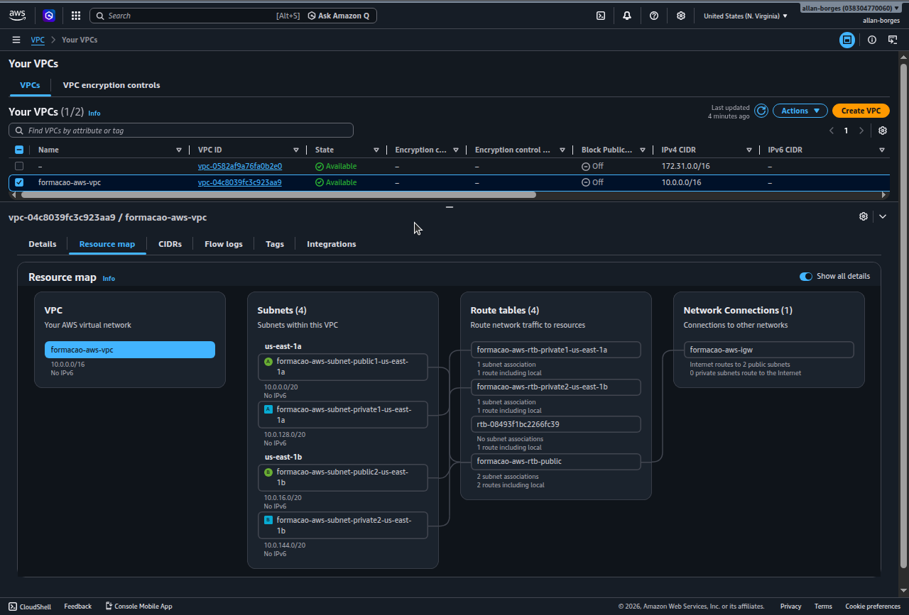
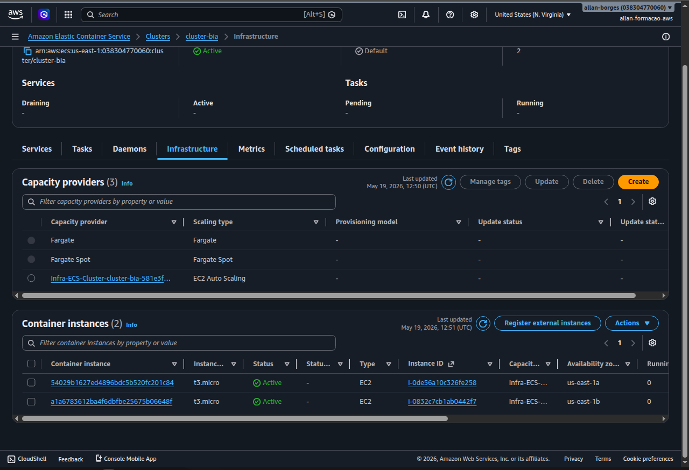
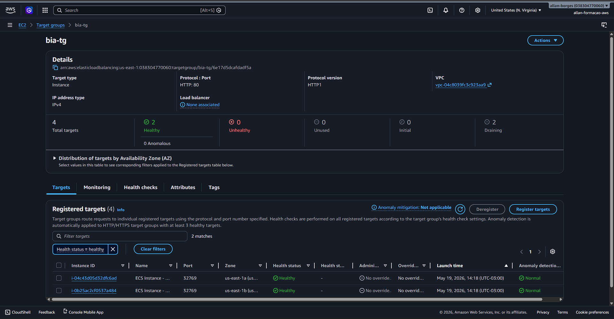
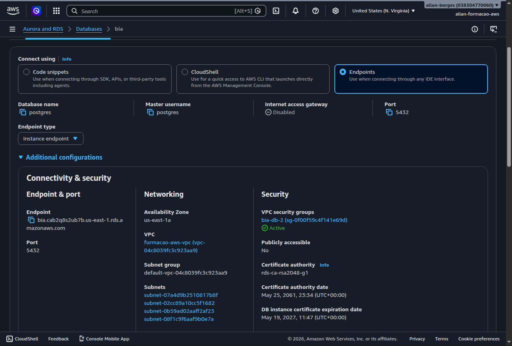
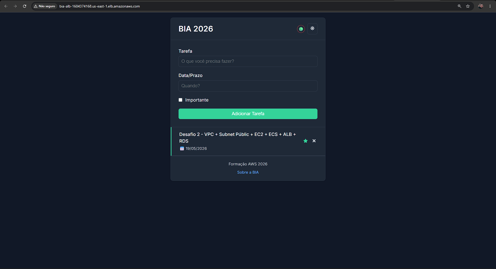

# 🏗️ AWS - Alta Disponibilidade
> Aplicação em Alta Disponibilidade com VPC, EC2, ECS, RDS e ALB


---

## 📌 Sobre o Projeto

O foco deste repositório é demonstrar não apenas o código da aplicação, mas o seu deploy em uma infraestrutura AWS desenhada para **alta disponibilidade e resiliência**.

A arquitetura garante que a aplicação continue funcionando de forma ininterrupta, mesmo em caso de falha de uma Zona de Disponibilidade, utilizando serviços gerenciados como Auto Scaling Groups, Application Load Balancer e containers no Elastic Container Service (ECS).

---

## 🎯 Objetivos de Aprendizado e Prática

Com a implementação do BIA nesta arquitetura AWS, os principais pilares aplicados foram:

- [x] Configurar uma **VPC customizada** separando a rede em subnets públicas e privadas.
- [x] Implementar **Auto Scaling Groups** com políticas de escalonamento baseadas no consumo de CPU.
- [x] Subir a aplicação conteinerizada via **ECS (Elastic Container Service)** utilizando o AWS Fargate (Serverless).
- [x] Conectar a aplicação de forma segura a um banco de dados relacional **RDS (PostgreSQL)**, mantido isolado na subnet privada.
- [x] Distribuir e expor o tráfego de forma segura através de um **Application Load Balancer (ALB)**.
- [x] Executar rotinas de banco de dados e migrações (`sequelize`) em um ambiente containerizado.

---

## 🧱 Arquitetura da Infraestrutura


> 💡 *O diagrama acima ilustra o fluxo de tráfego seguro: o usuário acessa o ALB nas subnets públicas, que por sua vez roteia o tráfego para os containers do ECS Fargate nas subnets privadas. O banco de dados RDS também fica protegido nas subnets privadas.*

### Principais Componentes Utilizados

| Serviço AWS | Função na Arquitetura |
|---|---|
| **VPC & Subnets** | Isolamento de rede em 2 AZs. Subnets públicas para o Load Balancer e NAT Gateway; privadas para aplicação e BD. |
| **ECS Fargate** | Execução da aplicação Node.js / React em containers sem necessidade de gerenciar servidores. |
| **Application Load Balancer** | Ponto de entrada da aplicação. Faz o roteamento HTTP/HTTPS e checagem de integridade (Health Check). |
| **Auto Scaling Group** | Escalonamento automático horizontal das tasks do ECS quando a demanda aumenta. |
| **RDS (PostgreSQL/MySQL)** | Banco de dados relacional configurado em Multi-AZ para garantir failover automático em caso de desastres. |
| **Security Groups** | Firewalls virtuais que garantem a regra de menor privilégio (ex: RDS aceita tráfego apenas do ECS). |
| **CloudWatch** | Centralização de logs e configuração de alarmes baseados nas métricas de performance. |

---

## ⚙️ Como a Arquitetura foi Implementada

Passo a passo resumido de como o ambiente foi construído na nuvem:

1. **Rede:** Criação da VPC cobrindo 2 Zonas de Disponibilidade (AZs) para redundância.
2. **Segurança:** Configuração dos Security Groups aplicando restrições em camadas (Tráfego Externo → ALB → ECS → RDS).
3. **Containers:** Criação do repositório no ECR, envio da imagem Docker do BIA e deploy via ECS Fargate usando uma *Task Definition*.
4. **Escalabilidade:** Configuração do Auto Scaling com política para adicionar novas instâncias automaticamente caso o uso de CPU ultrapasse 70%.
5. **Resiliência:** Validação de failover derrubando manualmente uma task e confirmando que o Auto Scaling Group provisionou uma nova em menos de 2 minutos.

---

## 💡 Decisões Técnicas e Aprendizados

- **Por que ECS Fargate e não instâncias EC2 cruas?** O Fargate remove o *overhead* de ter que gerenciar o sistema operacional, aplicar patches de segurança e configurar o Docker nos hosts. Foca-se 100% no container.
- **Por que Multi-AZ no RDS?** É vital para sistemas em produção. Se um data center inteiro da AWS cair, o RDS promove automaticamente a réplica da outra AZ para master sem perda de dados.
- **Isolamento de Rede:** O uso de subnets privadas com *NAT Gateway* permite que os containers do ECS baixem dependências da internet com segurança, sem que seus IPs fiquem expostos publicamente a potenciais ataques.

---

## 📸 Evidências (Prints do Console AWS)

Como este é um projeto de infraestrutura na nuvem, recomendo salvar capturas de tela do Console da AWS para comprovar a implementação real dos recursos.

<details>
<summary>Ver prints de evidência</summary>

### Topologia da VPC


### Cluster ECS e Instâncias


### Application Load Balancer


### RDS (Banco de Dados)


### Aplicação Respondendo (DNS do ALB)


</details>

---

## 🚀 Como Executar Localmente (Desenvolvimento)

Para rodar a aplicação BIA na sua máquina local de forma independente da nuvem, você precisa ter o **Docker** instalado.

1. Suba os containers locais utilizando o docker-compose:
```bash
docker compose up -d
```

2. **Passo importante:** Após os containers subirem, você precisa rodar as migrations do banco de dados (Sequelize) direto de dentro do container:
```bash
docker compose exec server bash -c 'npx sequelize db:migrate'
```

A aplicação estará disponível na porta `3000`.

---

## 🔗 Artigo no Medium

Escrevi um artigo muito mais profundo e detalhado explicando todo o processo de criação desta infraestrutura:

📖 **[Leia o artigo completo no Medium →](https://medium.com/@alanborges195/projeto-prático-rodando-uma-aplicação-em-alta-disponibilidade-com-vpc-customizada-ec2-ecs-rds-e-53b4d1099f4d)**

---

## 📁 Estrutura Atual do Repositório

Após a limpeza de artefatos temporários, o repositório contém puramente o código da aplicação BIA e os arquivos essenciais para execução:

```
📁 bia/
├── api/                  ← Rotas e controllers do Backend (Node.js/Express)
├── client/               ← Aplicação Frontend em React
├── config/               ← Configurações do ambiente e do Express
├── database/             ← Migrations do banco de dados (Sequelize)
├── server.js             ← Entrypoint principal da API
├── Dockerfile            ← Receita do container Docker da aplicação
├── compose.yml           ← Orquestração para ambiente de desenvolvimento local
└── README.md             ← Esta documentação
```

---

## 👤 Autor

**Allan Felipe Antunes Borges**  
☁️ AWS Certified — Cloud Practitioner | Solutions Architect | Developer Associate  
🔗 [LinkedIn](https://linkedin.com/in/alan-borges23) • [Medium](https://medium.com/@alanborges195) • [GitHub](https://github.com/allan-felipe23)
